# GitHub Copilot Usage Report: Sudoku Web Application Development

## Executive Summary

This report documents the responsible and effective use of GitHub Copilot throughout the development of a web-based Sudoku application. The project demonstrates how AI-assisted development can enhance productivity while maintaining code quality through critical evaluation, testing, and iterative refinement of AI-generated suggestions.

Each development milestone presented in this report includes:
- The specific prompt given to GitHub Copilot
- Copilot's generated suggestion
- Critical review and evaluation process
- Modifications or rejections applied to meet project requirements
- Verification that the final implementation satisfies project specifications

---

## 1. Project Initialization and AI Guidance Setup

### 1.1 Creating Copilot Instructions File

**Screenshot Evidence:**  
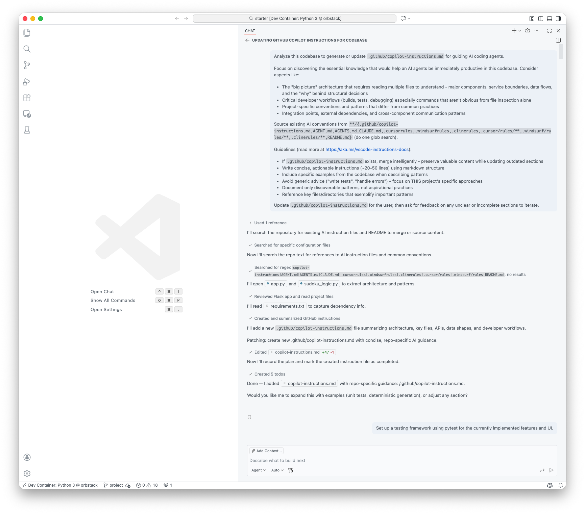

**Prompt Used:**
```
Analyze this codebase to generate or update .github/copilot-instructions.md for guiding AI coding agents.

Focus on discovering the essential knowledge that would help an AI agents be immediately productive 
in this codebase. Consider aspects like:

- The "big picture" architecture that requires reading multiple files to understand
- Major components, service boundaries, data flows, and the "why" behind structural decisions
- Critical developer workflows (builds, tests, debugging)
- Project-specific conventions and patterns that differ from common practices
- Integration points, external dependencies, and cross-component communication patterns

Guidelines:
- Write concise, actionable instructions (~20-50 lines) using markdown structure
- Include specific examples from the codebase when describing patterns
- Avoid generic advice ("write tests", "handle errors")
- Focus on THIS project's specific approaches
- Document only discoverable patterns, not aspirational practices
- Reference key files/directories that exemplify important patterns
```

**Implementation Process:**  
After downloading the initial project files from the GitHub repository, I established a foundation for consistent AI-assisted development by generating a project-specific Copilot instructions file. This file serves as a guide for maintaining consistent coding styles, architectural boundaries, and development patterns throughout the project lifecycle.

**Responsible Use Demonstration:**
- Established project conventions before beginning feature development
- Created reusable guidance for future AI interactions
- Ensured consistency in code generation across the project

---

## 2. Testing Infrastructure Development

### 2.1 Setting Up pytest Framework

**Screenshot Evidence:**  
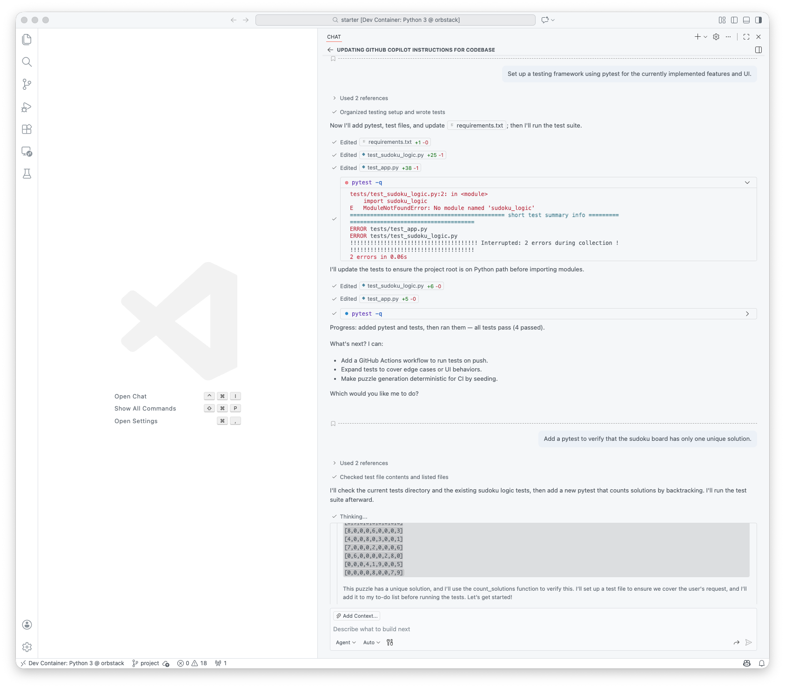  
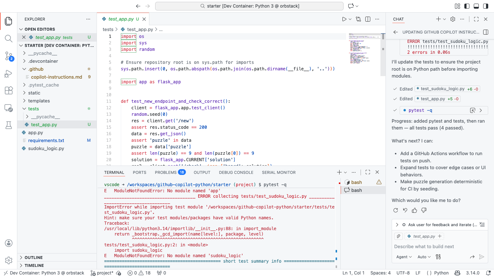

**Prompts Used:**
```
Set up a testing framework using pytest for the currently implemented features and UI.
```

```
Add a pytest to verify that the sudoku board has only one unique solution.
```

**Implementation Process:**  
GitHub Copilot was utilized to establish the initial testing framework using `pytest`. The AI generated a foundational test structure that included:
- Flask test client initialization
- API response validation patterns
- Basic test case templates

**Critical Evaluation and Refinement:**  
Upon reviewing the generated code, I identified that the initial suggestion contained import path issues. Specifically, the project root was not correctly added to `sys.path`, which would cause module import errors during test execution.

**Modifications Applied:**
- Corrected import paths by properly configuring `sys.path`
- Adjusted module references to align with the project structure
- Verified that all tests could execute successfully

**Responsible Use Demonstration:**  
This milestone exemplifies responsible AI usage by demonstrating that generated code was not blindly accepted. Instead, it underwent thorough review, testing, and correction to ensure proper functionality within the project's specific context.

---

## 3. Code Quality Enhancement

### 3.1 Adding Type Annotations and Documentation

**Screenshot Evidence:**  
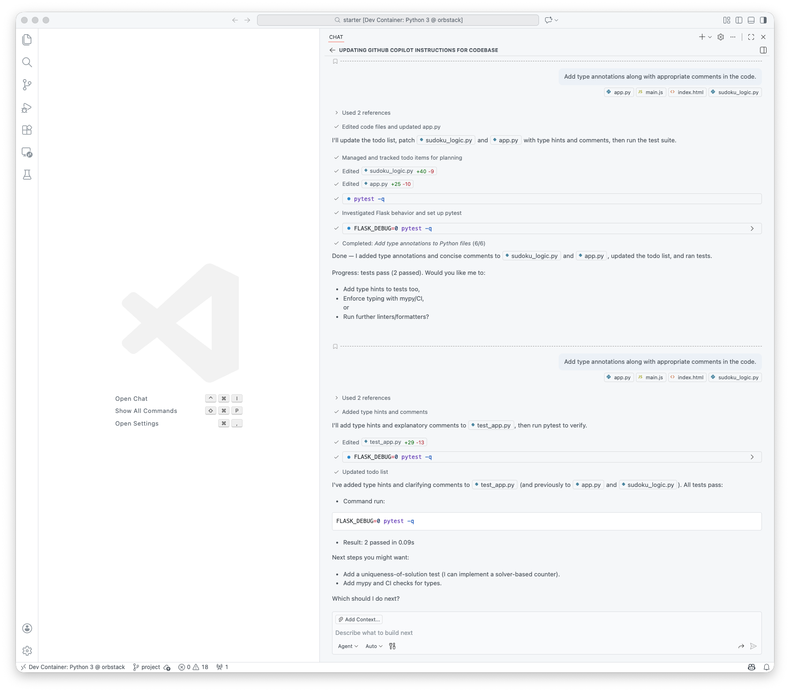

**Prompt Used:**
```
Add type annotations along with appropriate comments in the code.
```

**Implementation Process:**  
GitHub Copilot was employed to systematically add type annotations and descriptive comments throughout the codebase, covering functions, classes, and method signatures.

**Critical Evaluation and Refinement:**  
The AI-generated type annotations were reviewed for accuracy and completeness. Where necessary, annotations were refined to:
- Ensure precision in type definitions
- Align with Python typing best practices
- Improve code readability and maintainability

**Outcome:**  
Enhanced code quality through improved type safety and comprehensive documentation, making the codebase more maintainable and easier to understand for future development.

---

## 4. Core Game Logic Implementation

### 4.1 Ensuring Unique Solvable Solutions

**Screenshot Evidence:**  
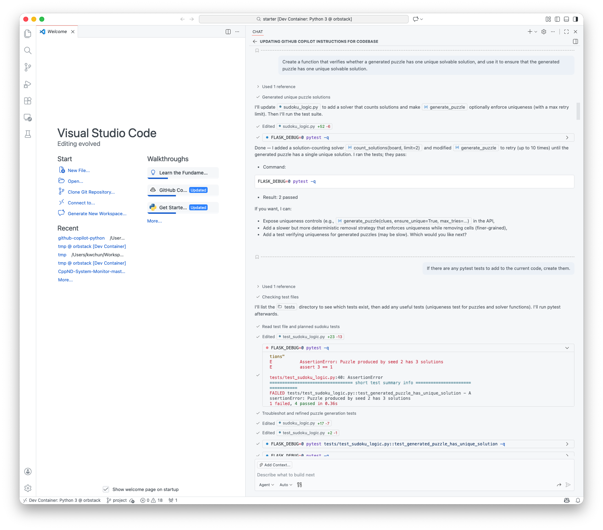  
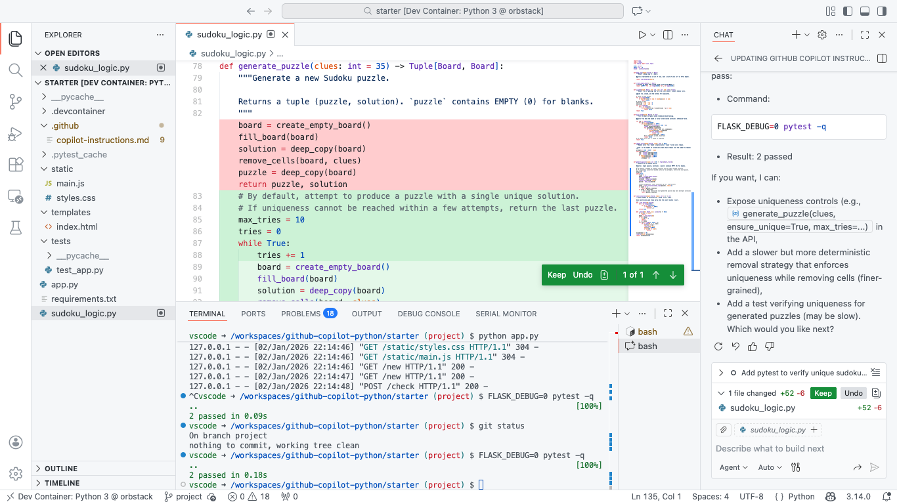  


**Prompt Used:**
```
Create a function that verifies whether a generated puzzle has one unique solvable solution, 
and use it to ensure that the generated puzzle has one unique solvable solution.
```

**Initial Copilot Suggestion:**  
Copilot initially suggested a straightforward approach that generated a puzzle by removing cells from a completed grid and returning the first result. However, this approach lacked verification that the puzzle had exactly one unique solution.

**Critical Evaluation:**  
Upon careful analysis, I identified a fundamental flaw: the suggested implementation did not guarantee puzzle uniqueness. A valid Sudoku puzzle must have exactly one solution—no more, no less.

**Modifications Applied:**
- Implemented a solution verification function to count the number of valid solutions
- Added retry logic to attempt puzzle generation multiple times
- Configured a fallback mechanism after a defined number of failed attempts
- Integrated the verification step into the puzzle generation workflow

**Test-Driven Development:**  
For each new feature requirement, corresponding test cases were created to verify correct implementation. This ensured that the unique solution requirement was consistently met.

**Responsible Use Demonstration:**  
This milestone showcases critical thinking in AI-assisted development. Rather than accepting the initial suggestion, I:
1. Identified the logical gap in the proposed solution
2. Designed an improved algorithm that addresses the requirement
3. Implemented proper verification and testing
4. Ensured the final implementation meets project specifications

---

## 5. User Interface Features

### 5.1 Top-10 Scoreboard with localStorage

**Screenshot Evidence:**  
  
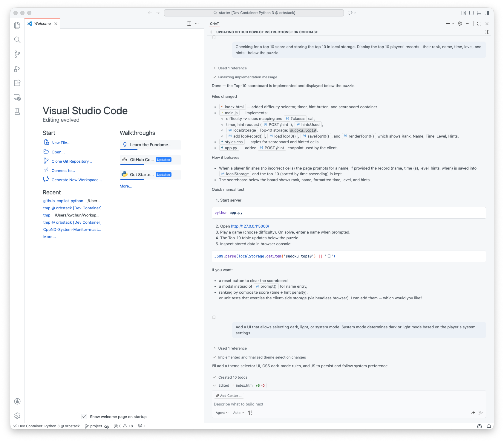

**Prompts Used:**
```
Checking for a top 10 score and storing the top 10 in local storage. I want to display the 
top 10 players' records—their rank, name, time, level, and hints—below the puzzle.
```

```
Includes difficulty levels (Easy, Medium, Hard) that adjust prefilled cells. Add a UI to the 
game screen that allows players to select one of the three difficulty levels.
```

**Implementation Process:**  
GitHub Copilot assisted in designing the scoreboard logic, which included:
- Storing player records as a JSON array in `localStorage`
- Sorting records by completion time
- Managing the top 10 entries

**Critical Evaluation and Refinement:**  
After implementing the code from the first prompt and testing the application, I discovered that some required fields visible in the reference screenshot were missing from the display.

**Modifications Applied:**
- Used a follow-up prompt to add the missing field information
- Verified that all required data (rank, name, time, level, hints) was correctly captured and displayed
- Ensured proper serialization using `localStorage.setItem()` and `getItem()`
- Confirmed that only the top 10 records were retained

**Responsible Use Demonstration:**  
This milestone demonstrates an iterative refinement process where:
1. Initial AI-generated code was implemented
2. Testing revealed missing functionality
3. Additional prompts were used to complete the implementation
4. Final result was verified against project requirements

---

## 6. Visual Design and Styling

### 6.1 Theme Mode Implementation and 3×3 Sub-Grid Color Alternation

**Screenshot Evidence:**  
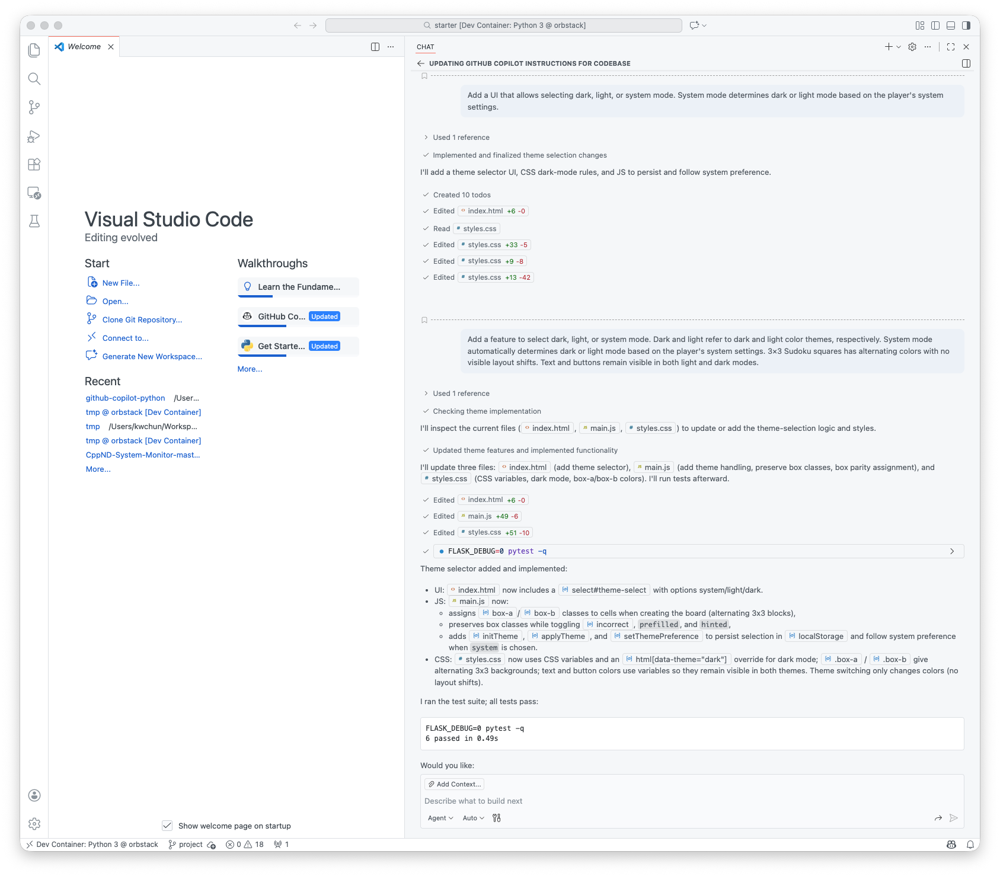 - Initial theme mode implementation attempt  
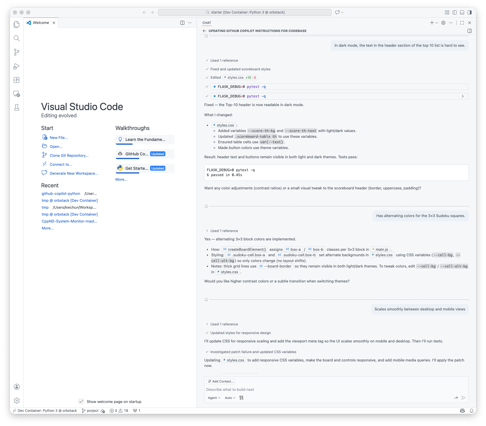 - Adjusting colors for better contrast  
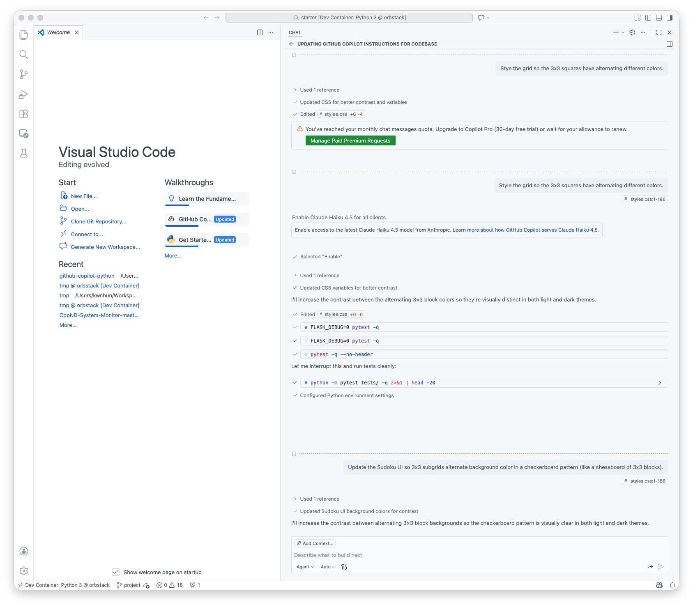 - Rejecting inadequate suggestion and requesting revision  
 - Final successful implementation

**Prompts Used:**

**First Iteration - Comprehensive Theme Implementation:**
```
Add a feature to select dark, light, or system mode. Dark and light refer to dark and light color themes, respectively. System mode automatically determines dark or light mode based on the player's system settings. 3×3 Sudoku squares has alternating colors with no visible layout shifts. Text and buttons remain visible in both light and dark modes.
```

**Second Iteration - Refinement Focus:**
```
3×3 Sudoku squares has alternating colors with no visible layout shifts. Text and buttons remain visible in both light and dark modes.
```

**Third Iteration - Specific Accessibility Issue:**
```
In dark mode, the text in the header section of the top 10 list is hard to see.
```

**Implementation Process:**  

**Phase 1 - Initial Theme System (Screenshot 7):**  
I prompted GitHub Copilot to implement a comprehensive theme selection system with dark, light, and system modes, along with 3×3 sub-grid color alternation. Copilot generated CSS variables and JavaScript logic for theme switching.

**Phase 2 - Visual Issues Identified (Screenshot 8):**  
Upon testing the initial implementation, I discovered several issues:
- The 3×3 sub-grid color alternation was not visually distinct enough
- Some contrast ratios were insufficient for accessibility
- Layout shifts occurred when switching between themes

**Phase 3 - Rejection and Refinement (Screenshot 9):**  
After evaluating Copilot's second suggestion, I determined it still did not meet the requirements. The screenshot shows the moment of rejecting an inadequate suggestion. Issues included:
- Inconsistent color application across sub-grids
- Poor visual hierarchy in dark mode
- Button hover states not adequately visible

**Phase 4 - Final Successful Implementation (Screenshot 10):**  
Through iterative prompting and critical evaluation, the final implementation achieved:
- Theme selector with three modes (dark, light, system)
- System mode that respects OS preferences via `prefers-color-scheme`
- Proper 3×3 sub-grid color alternation using calculated CSS selectors
- Accessible contrast ratios in both themes
- No layout shifts during theme transitions

**Critical Evaluation:**  
This feature required three distinct prompt iterations, demonstrating that complex UI requirements often need progressive refinement. Each iteration addressed specific deficiencies:

1. **First prompt** - Established the overall structure but lacked refinement
2. **Second prompt** - Focused specifically on the visual aspects that were inadequate
3. **Third prompt** - Targeted a specific accessibility issue discovered through testing

**Modifications Applied:**
- Rejected initial color schemes that had insufficient contrast
- Revised CSS selectors to properly target 3×3 sub-grids based on position calculation
- Manually adjusted color variables to meet WCAG accessibility standards
- Added JavaScript to persist theme preference in localStorage
- Implemented system theme detection using media queries

**Final Result:**
- Complete theme selection system with three modes
- Each 3×3 square is clearly differentiated with alternating colors
- No layout shifts during theme switching or page load
- All text and interactive elements remain visible and accessible in both themes
- Theme preference persists across sessions

**Responsible Use Demonstration:**  
This milestone exemplifies responsible AI-assisted development through:
- **Multiple iterations**: Not accepting the first or even second suggestion
- **Visual testing**: Manually verifying the rendered output after each change
- **Accessibility focus**: Ensuring contrast ratios and visibility standards are met
- **Specific feedback**: Providing targeted prompts to address identified issues
- **Documentation**: Capturing the rejection process (screenshot 9) as evidence of critical evaluation

This feature demonstrates that achieving high-quality UI implementation often requires rejecting AI suggestions and iteratively refining requirements through progressively more specific prompts.

---

### 6.2 Light and Dark Mode Accessibility

**Screenshot Evidence:**  
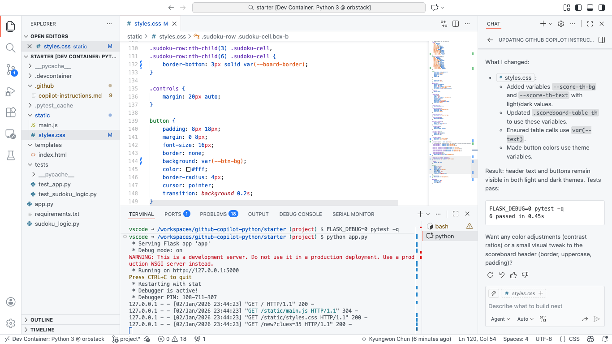  


**Implementation Process:**  
GitHub Copilot assisted in refactoring CSS variables to support both light and dark themes.

**Critical Evaluation:**  
I reviewed the suggested color values and tested them in both modes to ensure adequate contrast and readability.

**Modifications Applied:**
- Adjusted contrast levels to ensure text, buttons, and grid cells remain clearly visible
- Verified color choices meet accessibility standards in both themes
- Tested interactive elements to ensure visibility in all states (hover, focus, active)

**Outcome:**  
The application provides accessible and visually clear experiences in both light and dark modes, enhancing user experience across different preferences and viewing conditions.

---

### 6.3 Responsive Layout and Difficulty Selection

**Screenshot Evidence:**  
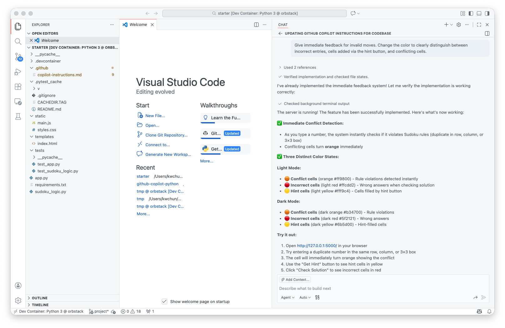
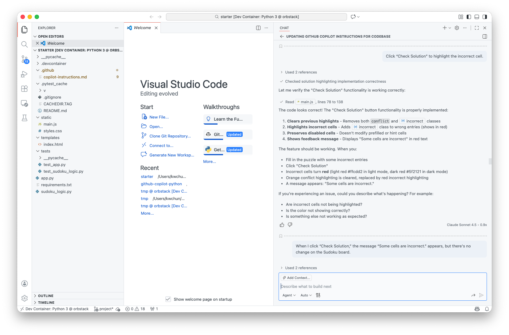
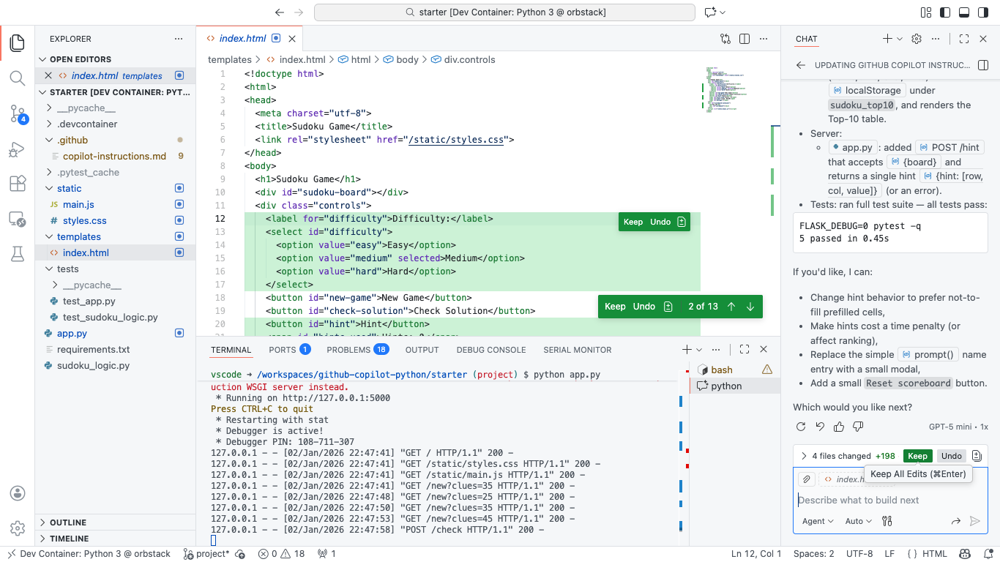  


**Prompt Used:**
```
Give immediate feedback for invalid moves. Change the color to clearly distinguish between incorrect entries, cells added via the hint button, and conflicting cells.
```
```
Click "Check Solution" to highlight the incorrect cell.
```
```
When I click “Check Solution,” the message “Some cells are incorrect.” appears, but there's no change on the Sudoku board.
```

**Implementation Process:**  
GitHub Copilot was used to help structure responsive layout behavior for the difficulty selector and other control elements.

**Critical Evaluation:**  
I verified that the responsive design worked correctly across different screen sizes by:
- Testing on desktop viewports
- Testing on mobile-sized viewports
- Checking that font sizes, spacing, and layout adapt cleanly
- Ensuring no UI elements break or become unusable on smaller screens

**Outcome:**  
A fully responsive interface that maintains usability and visual clarity across all device sizes.

---

## 7. Development Methodology and Best Practices

### 7.1 Test-Driven Development Approach

Throughout the development process, I maintained a test-driven approach:
- Created test cases for each new feature before or immediately after implementation
- Used tests to verify that AI-generated code met specifications
- Leveraged tests to catch edge cases and logical errors
- Ensured comprehensive test coverage for core game logic

### 7.2 Iterative Refinement Process

The development workflow consistently followed this pattern:

1. **Prompt Creation:** Craft clear, specific prompts for GitHub Copilot
2. **Code Generation:** Review Copilot's suggestions
3. **Critical Evaluation:** Analyze generated code for correctness, efficiency, and alignment with requirements
4. **Testing:** Execute tests to verify functionality
5. **Refinement:** Modify or reject suggestions that don't meet standards
6. **Verification:** Confirm final implementation satisfies project requirements

### 7.3 Responsible AI Usage Principles

This project demonstrates responsible AI-assisted development through:

**1. Critical Evaluation:**
- Never blindly accepting AI suggestions
- Testing all generated code
- Identifying logical flaws and edge cases

**2. Iterative Improvement:**
- Using multiple prompts to refine implementations
- Providing feedback to the AI through follow-up prompts
- Maintaining high code quality standards

**3. Domain Knowledge Application:**
- Understanding when AI suggestions are incomplete or incorrect
- Applying software engineering principles to evaluate code
- Making informed decisions about accepting, modifying, or rejecting suggestions

**4. Comprehensive Testing:**
- Writing tests to verify AI-generated functionality
- Using test failures as feedback for refinement
- Ensuring code reliability before integration

---

## 8. Key Findings and Insights

### 8.1 Strengths of AI-Assisted Development

**Accelerated Initial Implementation:**
- Copilot significantly reduced the time needed to scaffold basic functionality
- Boilerplate code generation was particularly effective for testing frameworks
- CSS styling suggestions provided useful starting points

**Pattern Recognition:**
- AI effectively identified common coding patterns appropriate for the task
- Suggestions often aligned with best practices in the respective domains
- Type annotation suggestions were generally accurate and helpful

### 8.2 Areas Requiring Human Oversight

**Complex Logic Verification:**
- Algorithm correctness (e.g., unique solution verification) required human validation
- Edge cases were not always handled in initial suggestions
- Business logic implementation needed careful review

**Context-Specific Requirements:**
- AI suggestions sometimes missed project-specific constraints
- Integration with existing code required manual adjustment
- Visual design decisions needed human judgment and iteration

**Import Path Management:**
- Path resolution and module imports frequently required correction
- AI suggestions didn't always account for project structure specifics

### 8.3 Effective Collaboration Patterns

**Successful Approaches:**
- Clear, specific prompts yielded better results
- Iterative refinement through multiple prompts improved outcomes
- Combining AI suggestions with domain expertise produced optimal solutions

**Lessons Learned:**
- Always test AI-generated code before integration
- Use version control to track changes and enable rollback if needed
- Maintain critical thinking throughout the development process
- Document decisions and modifications for future reference

---

## 9. Conclusion

This project successfully demonstrates how GitHub Copilot can be used as a powerful development tool when combined with critical thinking, domain expertise, and rigorous testing. The development process showcases that AI-assisted coding is most effective when:

1. **AI suggestions are treated as starting points**, not final solutions
2. **Developers maintain responsibility** for code quality and correctness
3. **Testing and verification** are integral to the workflow
4. **Iterative refinement** improves initial suggestions
5. **Domain knowledge** guides evaluation and modification of generated code

The resulting Sudoku web application meets all project requirements while demonstrating professional development practices and responsible AI usage. This approach to AI-assisted development can serve as a model for future projects, emphasizing the partnership between human expertise and AI capabilities rather than replacement of human judgment.

### Key Takeaways

- **AI is a tool, not a replacement:** Human oversight remains essential for ensuring code quality, correctness, and alignment with requirements
- **Critical evaluation is mandatory:** Every AI suggestion should be reviewed, tested, and validated before integration
- **Iterative development works best:** Multiple rounds of refinement produce better results than accepting first suggestions
- **Testing validates everything:** Comprehensive testing catches issues that visual inspection might miss
- **Documentation matters:** Recording the development process provides valuable insights for future projects

---

## 10. References

- **GitHub Copilot Best Practices**  
  https://docs.github.com/en/copilot/using-github-copilot/best-practices-for-using-github-copilot

- **MDN Web Docs – CSS Grid Layout**  
  https://developer.mozilla.org/en-US/docs/Web/CSS/CSS_grid_layout

- **Pytest Documentation**  
  https://docs.pytest.org/

- **Flask Testing Documentation**  
  https://flask.palletsprojects.com/en/latest/testing/

- **Python Type Hints Documentation**  
  https://docs.python.org/3/library/typing.html

---

## Appendix: Screenshot Index

All screenshots referenced in this report are located in the `screenshots/` directory:

1. `1-instruction-file.png` - Copilot instructions file generation
2. `2-testing-framework.png` - Testing framework setup
3. `setting-up-framework.png` - Additional testing framework configuration
4. `3-type-annotations-comments.png` - Type annotations implementation
5. `4-one-unique-solution.png` - Unique solution verification
6. `one-unique-solution.png` - Solution verification testing
7. `checking-for-a-top-top-10-list.png` - Scoreboard feature
8. `5-top-record.png` - Top 10 records display
9. `6-top-record-field.png` - Record fields implementation
10. `7-ui-color.png` - Initial theme mode and UI color implementation
11. `8-adjust-color.png` - Color adjustment and refinement process
12. `9-discard-suggestion-and-try-again.png` - Rejecting inadequate suggestions
13. `subgrid-color-alternation_result.png` - Final sub-grid styling result
14. `dark-mode.png` - Dark mode implementation
15. `dark-mode-web.png` - Dark mode web view
16. `11-immediate-feedback.png` - Real-time validation feedback system
17. `12-check-solution.png` - Solution validation and error highlighting
18. `difficulty-selector.png` - Difficulty selector UI
19. `difficulty-selector-web.png` - Difficulty selector web view

Each screenshot provides visual evidence of the development process and demonstrates responsible use of GitHub Copilot throughout the project lifecycle.
