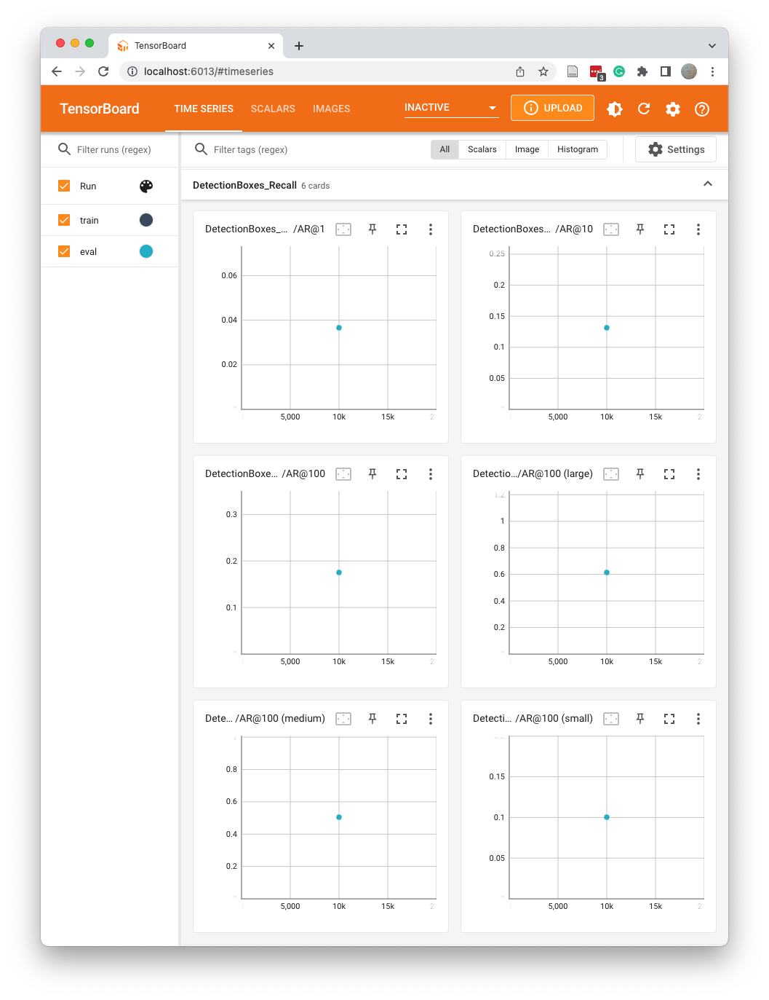

# Object Detection in an Urban Environment (Korean)

## Project Overview
This project is to train a convolutional neural network that uses data from the [Waymo Open Dataset](https://waymo.com/open/) to detect and classify objects. The video dataset of an urban environment contains labels for bicyclists, pedestrians, and vehicles. The goal is to train a model to detect and classify these objects in a video.

First, you analyze data to verify the label distribution and sample footage. Then, you decide which data augmentations to use to achieve significant performance gains. You'll then train a neural network to detect and classify objects. You'll monitor the training with a TensorBoard and decide when to stop. Finally, you will experiment with different hyperparameters to improve your model's performance.

This project involves using the [TensorFlow Object Detection API](https://github.com/tensorflow/models/tree/master/research/object_detection), which allows you to deploy a model to get pedestrians in images sent to the API. Code is provided to generate short videos of the model's predictions.

## Structure

### Data

The data you will use for training, validation, and testing is organized as follow:
```
/app/project/data/waymo
    - raw/: contained the tf records in the Waymo Open format. (NOTE: this folder only contains temporary files and should be empty after running the download and process script)
    - processed/: contains the tf records in the Tf Object Detection API format. (NOTE: this folder only contains temporary files and should be empty after running the download and process scripts)
    - train/: contain the train data (empty to start)
    - val/: contain the val data (empty to start)
    - test/ - contain the test data (empty to start)
```

### Experiments
The experiments folder will be organized as follow:
```
experiments/
    - pretrained_model/: contains the checkpoints of the pretrained models.
    - exporter_main_v2.py: to create an inference model
    - model_main_tf2.py: to launch training
    - label_map.pbtxt: the label map file
    - reference/ - reference training with the unchanged config file
    - experiment0/ - a folder for the first experiment
    - experiment1/ - a folder for the second experiment
    - experiment2/ - a folder for the third experiment
    ...
```

## Prerequisites

### Requirements
 * NVIDIA GPU with the latest driver installed
 * docker / nvidia-docker

### Set the environment variables
You need to make a `.env` file and set the environment variables in the root directory of this repository. For example, to set the Jupyter server's port to 8013, the Jupyter server's access token to `letmein`, and the TensorBoard's port to 6013, and if you want to use the first two GPUs on your system, set them as follows:
```
JPYTER_PORT=8013
TENSORBOARD_PORT=6013
JUPYTER_TOKEN=letmein
GPU_DEVICES=0,1
```

### Build an image and run the container
You can build the image and run the container with the following command:
```
docker compose up -d --build
```
Once the container is running, you can run the following command to access the container:
```
docker exec -it {container name} bash
```
If the container is running, you can find the `{container name}` by running the `docker compose ps` command.

### Set up
Once in the container, you will need to auth using:
```
gcloud auth login
```

### Download and process the data
The first goal of this project is to download the data from [Waymo's Google Cloud bucket](https://console.cloud.google.com/storage/browser/waymo_open_dataset_v_1_2_0_individual_files/) to your local machine. For this project, you only need a subset of the data provided (for example, we do not need to use the Lidar data). Therefore, we are going to download and trim each file immediately. In `download_process.py`, you can view the `create_tf_example` function, which will perform this processing. This function takes the components of a Waymo TF record and saves them in the TF Object Detection API format. An example of such a function is described in the [tutorial](https://tensorflow-object-detection-api-tutorial.readthedocs.io/en/latest/training.html#create-tensorflow-records). We are already providing the `label_map.pbtxt` file.

You can run the script using the following command:
```
python download_process.py --data_dir {processed file location} --size {number of files you want to download}
```

You are downloading 100 files (unless you changed the `size` parameter), so be patient! Once the script is done, you can look inside your `data_dir` folder to see if the files have been downloaded and processed correctly.

## Exploratory Data Analysis
This is the most important task of any machine learning project. In the `Exploratory Data Analysis` notebook, you will implement a `display_instances` function to display images and annotations using `matplotlib`. The function displays the label as a box with different colors to distinguish between the three labels: bicyclists, pedestrians, and vehicles. Also, the image set contains diverse images, some blurry and clear, and some taken day and night. For example, the following image shows a frame with labels displayed using the `display_instances` function.


We can find statistics of the number of each label per frame using the `pandas` package.


The frames contain plenty of vehicles and pedestrians but few cyclists. These statistics can be more clearly seen when visualized as a histogram:


### Create splits
For this project, you must create training and validation sets using the files in `/app/project/data/processed`. The `split` function in the `create_splits.py` file does the following:
* create three subfolders: `/app/project/data/train/`, `/app/project/data/val/`, and `/app/project/data/test/`
* split the TF records files between these three folders.

The script takes a holdout cross-validation strategy. The dataset is randomly split into training, validation, and test data, in ratios of 70%, 20%, and 10%, respectively. Use the following command to run the script:
```
python create_splits.py --source /app/project/data/processed --destination /app/project/data
```

### Edit the config file
The TF Object Detection API relies on config files. The config we will use for this project is **config files**. The config that we will use for this project is `pipeline.config`, which is the config for an SSD Resnet 50 640x640 model. You can learn more about the Single Shot Detector [here](https://arxiv.org/pdf/1512.02325.pdf).

First, download the [pretrained model](http://download.tensorflow.org/models/object_detection/tf2/20200711/ssd_resnet50_v1_fpn_640x640_coco17_tpu-8.tar.gz) and move it to `/app/project/experiments/pretrained_model/`.

We need to edit the config files to change the location of the training and validation files, as well as the location of the label_map file and pretrained weights. We also need to adjust the batch size. To do so, run the following:
```
python edit_config.py --train_dir /app/project/data/train/ --eval_dir /app/project/data/val/ --batch_size 2 --checkpoint /app/project/experiments/pretrained_model/ssd_resnet50_v1_fpn_640x640_coco17_tpu-8/checkpoint/ckpt-0 --label_map /app/project/experiments/label_map.pbtxt
```
A new config file has been created, `pipeline_new.config`.

### Training
You will now launch your very first experiment with the Tensorflow object detection API. Move the `pipeline_new.config` to the `/home/workspace/experiments/reference` folder. Now launch the training process:
* A training process:
```
python experiments/model_main_tf2.py --model_dir=experiments/reference/ --pipeline_config_path=experiments/reference/pipeline_new.config
```
Once the training is finished, launch the evaluation process:
* An evaluation process:
```
python experiments/model_main_tf2.py --model_dir=experiments/reference/ --pipeline_config_path=experiments/reference/pipeline_new.config --checkpoint_dir=experiments/reference/
```

**Note**: Both processes will display some Tensorflow warnings, which can be ignored. You may have to kill the evaluation script manually using
`CTRL+C`.

To monitor the training, you can launch a TensorBoard instance by running `tensorboard --logdir=experiments/reference/`. You can then access the TensorBoard interface by going to `http://localhost:6013/` (or whatever port you set in your `.env` file) in your browser.

### Export the trained model
Modify the arguments of the following function to adjust it to your models:
```
python experiments/exporter_main_v2.py --input_type image_tensor --pipeline_config_path experiments/reference/pipeline_new.config --trained_checkpoint_dir experiments/reference/ --output_directory experiments/reference/exported/
```

This should create a new folder, `experiments/reference/exported/saved_model`. You can read more about the TensorFlow SavedModel format in the [guide](https://www.tensorflow.org/guide/saved_model).

### Creating an animation
Finally, you can create a video of your model's inferences for any TF record file. To do so, run the following command (modify it to your files):
```
python inference_video.py --labelmap_path label_map.pbtxt --model_path experiments/reference/exported/saved_model --tf_record_path data/test/{tfrecord filename} --config_path experiments/reference/pipeline_new.config --output_path animation.gif
```

## Improve the performances
Most likely, this initial experiment did not yield optimal results. However, you can make multiple changes to the config file to improve this model. One obvious difference consists in enhancing the data augmentation strategy. The [`preprocessor.proto`](https://github.com/tensorflow/models/blob/master/research/object_detection/protos/preprocessor.proto) file contains the different data augmentation methods in the TF Object Detection API. To help you visualize these augmentations, we provide a notebook: `Explore augmentations.ipynb`. Using this notebook, try different data augmentation combinations and select the one you think is optimal for our dataset. Justify your choices in the write-up.

Keep in mind that the following are also available:
* Experiment with the optimizer: type of optimizer, learning rate, scheduler, etc
* Experiment with the architecture. The TF Object Detection API [model zoo](https://github.com/tensorflow/models/blob/master/research/object_detection/g3doc/tf2_detection_zoo.md) offers many architectures. Keep in mind that the `pipeline.config` file is unique for each architecture, and you must edit it.

**Important:** Your storage is limited if you are working on the workspace. You may delete the checkpoint files after each experiment. You should, however, keep the `tf.events` files in your experiments' `train` and `eval` folder. You can also save the `saved_model` folder to create your videos.

### Reference experiment
The training steps in the template are 25k, but to save time, we'll reduce them to 10k.

The evaluation set has very low mAP and recalls, with a smoothed total loss of 2.832.


In road videos, especially at night, you can see that cars are barely recognized.


### Add more data augmentation on the reference
`experiment0' added data augmentations that vary the hue, brightness, and contrast to improve recognition at night. The options kept their default values.
```
  data_augmentation_options {
    random_black_patches {
    }
  }
  data_augmentation_options {
    random_adjust_brightness {
    }
  }
  data_augmentation_options {
    random_adjust_contrast {
    }
  }
  data_augmentation_options {
    random_adjust_hue {
    }
  }
  data_augmentation_options {
    random_adjust_saturation {
    }
  }
  data_augmentation_options {
    random_distort_color {
    }
  }
``` 

We can see that the smoothed total loss for evaluation has decreased to 1.691. The bumps in the training curve are probably due to the learning rate being tuned for 25k steps of training.


### Adjust optimizer
In `experiment1`, we set the learning rate to 10k and the overall learning rate to be lower. We also apply the ADAM optimizer, which has good training performance for various models.
```
  optimizer {
    adam_optimizer: {
      learning_rate: {
        cosine_decay_learning_rate {
          learning_rate_base: .0002
          total_steps: 10000
          warmup_steps: 1000
          warmup_learning_rate: .0001
        }
      }
    }
    use_moving_average: false
  }
```

You can see that some of the mAPs and recalls improved very significantly. Also, we can see that the smoothed total loss is 0.7842, which is a significant reduction compared to the reference's smoothed total loss.





If you test with nighttime road footage, you'll see some improvements in car recognition. However, there is still much room for improvement, as many vehicles are not recognized.


