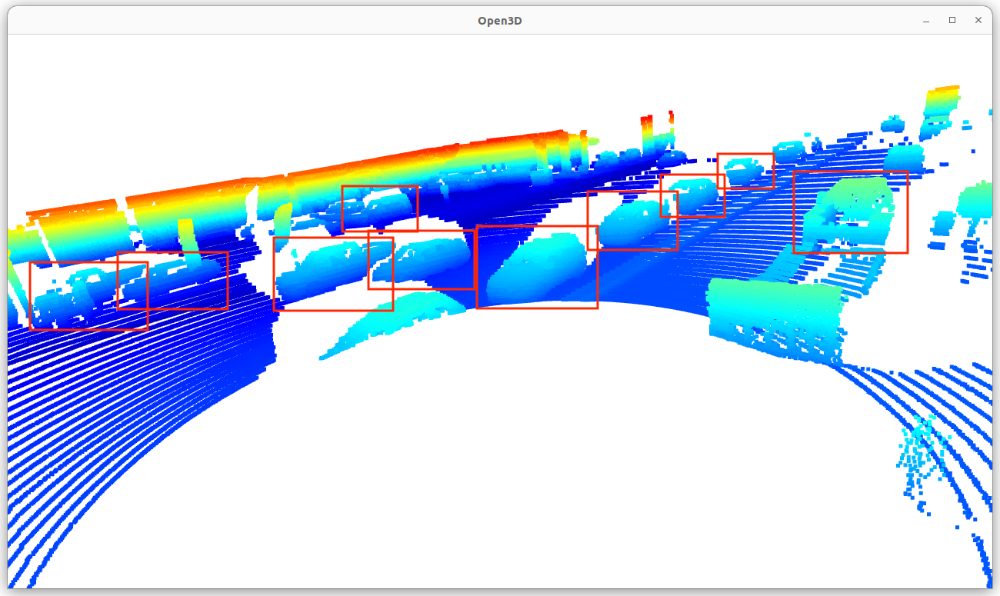
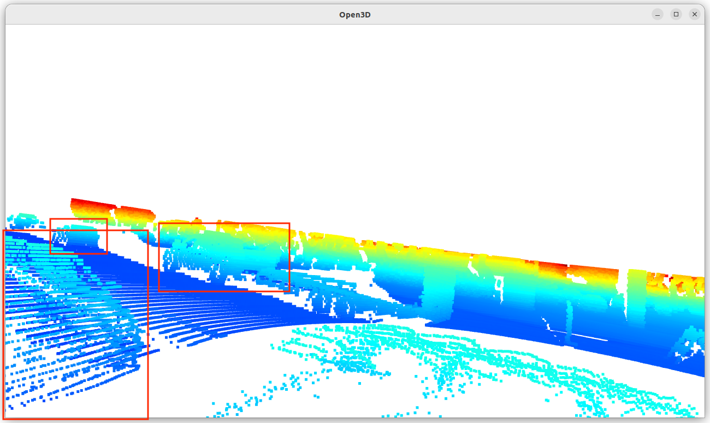
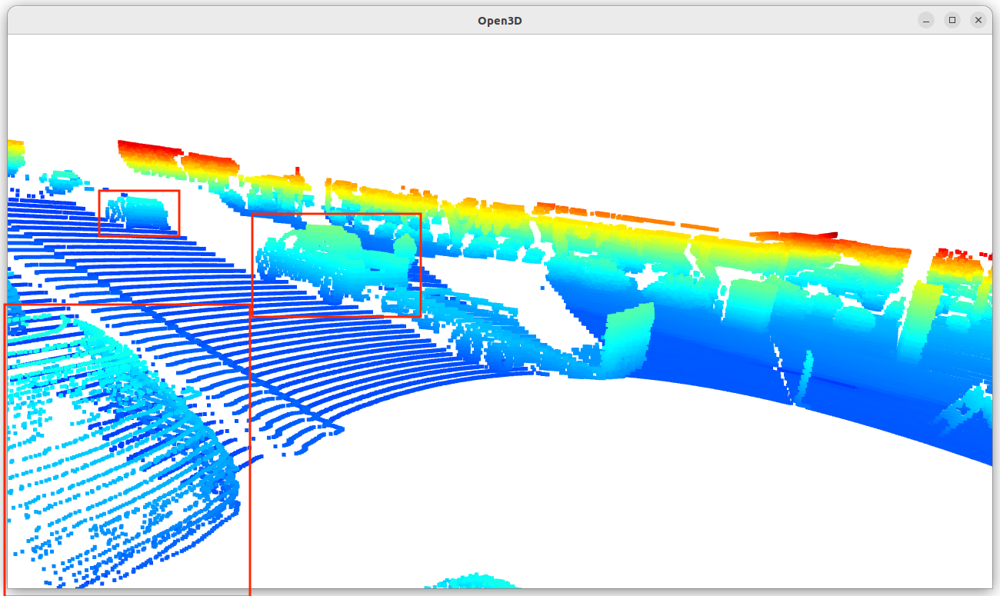
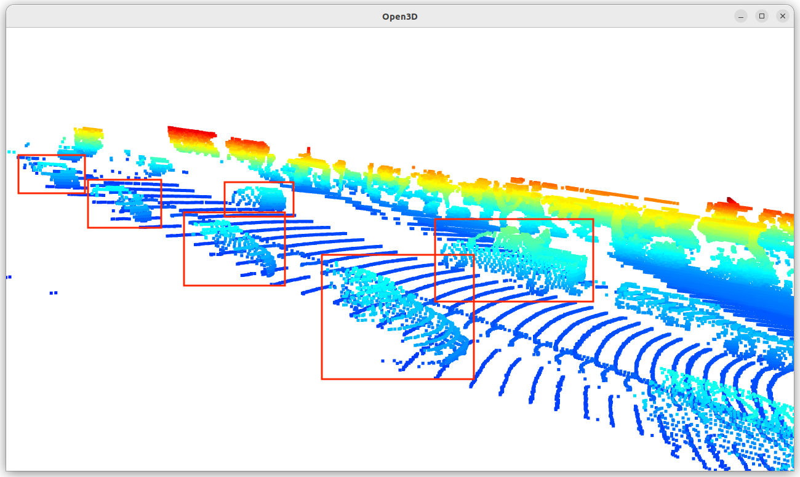
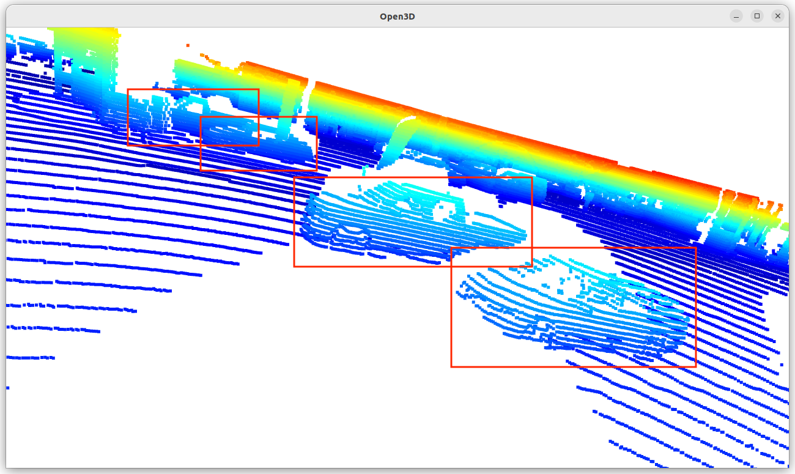
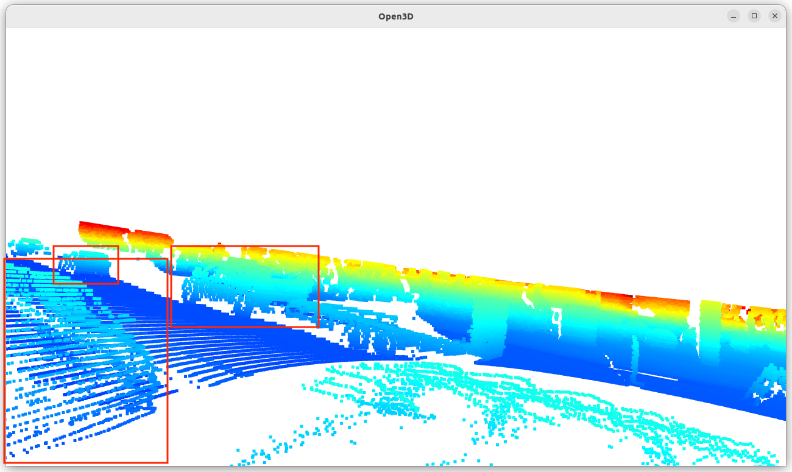
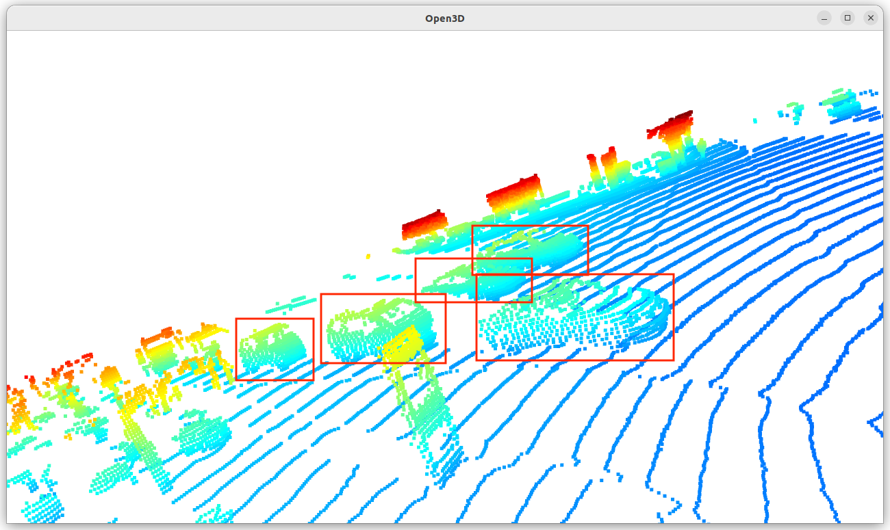
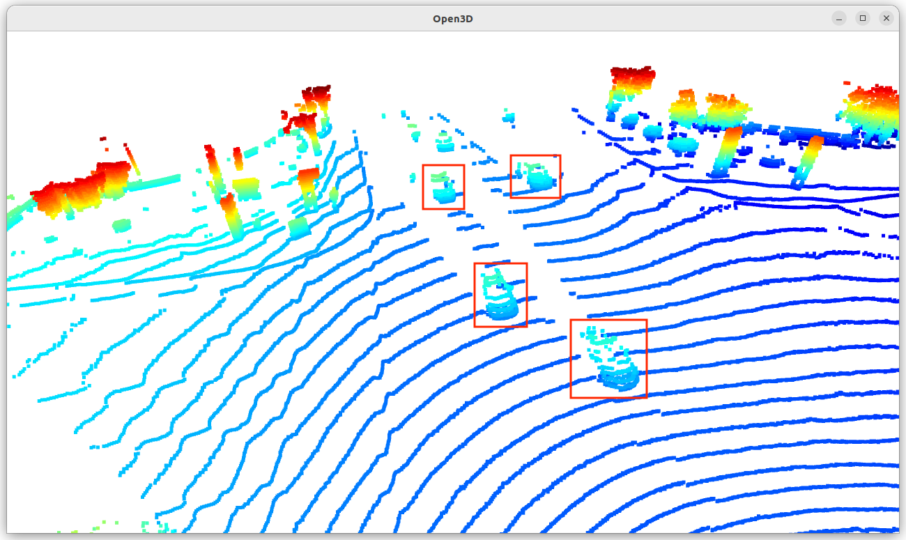
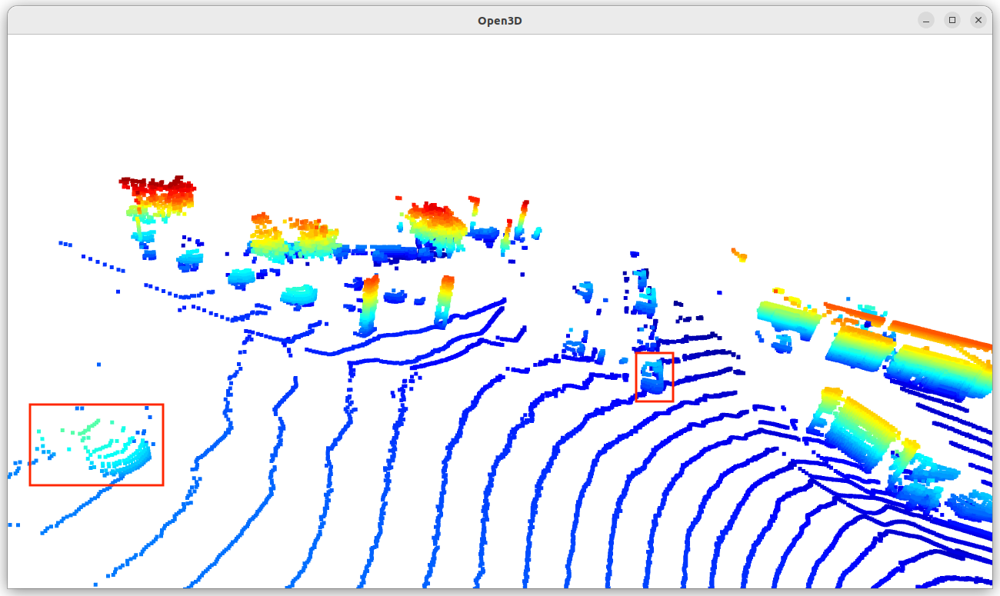

# Writeup: 3D Objects Detection

## Visualize point-cloud
### Find 10 examples of vehicles with varying degrees of visibility in the point-cloud

### Try to identify vehicle features that appear stable in most of the inspected examples and describe them.
Depending on the position and orientation of the vehicle, the shading only allows you to see certain parts of the car, so you can't pick up consistent features. However, we can see that the side-view mirrors work well for certain vehicle orientations. You can also see that the windows of the car, which are silhouetted by the bonnet and the respective pillars, are also well captured depending on the orientation. The wheels are also a characteristic feature well-defined when photographing the vehicle from the side.

### 1. Write a short recap of the four tracking steps and what you implemented there (filter, track management, association, camera fusion). Which results did you achieve? Which part of the project was most difficult for you to complete, and why?

### 2. Do you see any benefits in camera-lidar fusion compared to lidar-only tracking (in theory and in your concrete results)? 

### 3. Which challenges will a sensor fusion system face in real-life scenarios? Did you see any of these challenges in the project?

### 4. Can you think of ways to improve your tracking results in the future?

