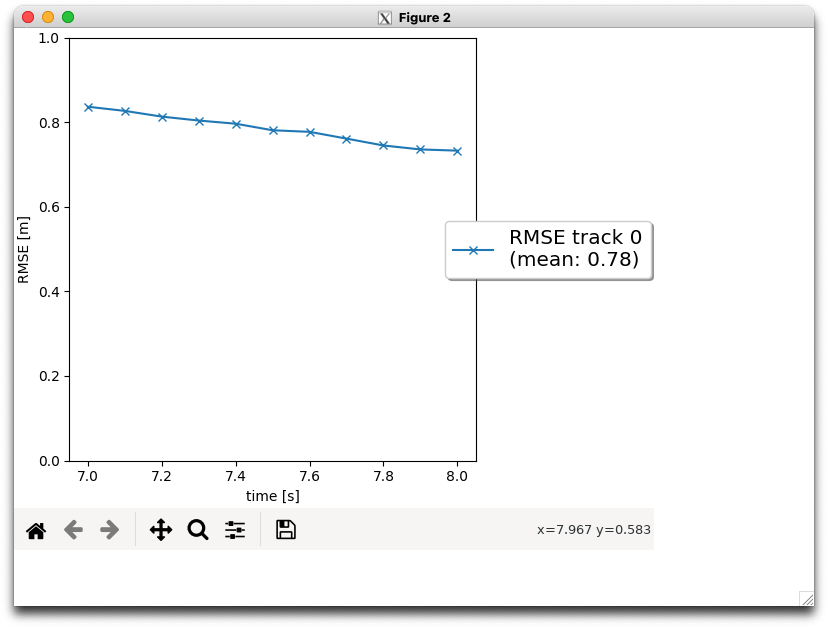

# Writeup: Track 3D-Objects Over Time

## 3D Object Detection

### 1. Find 10 examples of vehicles with varying degrees of visibility in the point-cloud

### 2. Try to identify vehicle features that appear stable in most of the inspected examples and describe them.
Depending on the position and orientation of the vehicle, the shading only allows you to see certain parts of the car, so you can't pick up consistent features. However, we can see that the side-view mirrors work well for certain vehicle orientations. You can also see that the windows of the car, which are silhouetted by the bonnet and the respective pillars, are also well captured depending on the orientation. The wheels are also a characteristic feature well-defined when photographing the vehicle from the side.

### 3. Performance Measures

## Sensor Fusion and Object Tracking

### 1. Write a short recap of the four tracking steps and what you implemented there (filter, track management, association, camera fusion). Which results did you achieve? Which part of the project was most difficult for you to complete, and why?

In Step 1 of the final project, I implemented an EKF to track a single real-world target with lidar measurement input over time! The RMSE plot shows a mean RMSE of 0.35 or smaller. I can see the computed mean RMSE in the legend on the right. 

In Step 2 of the final project, I implemented track management to initialize and delete tracks and set a track state and a track score. The visualization shows that a new track is initialized automatically where unassigned measurements occur, the true track is confirmed quickly, and the track is deleted after it has vanished from the visible range. I can see that the track has been deleted if the console output says 'deleting track no. 0'. There is one single track without track losses in between, so the RMSE plot shows a single line.  

In Step 3 of the final project, I implemented a single nearest-neighbor data association to associate measurements with tracks. I see in the visualization that multiple tracks are updated with multiple measurements. The console output shows that each measurement is used at most once, and each track is updated at most once. The visualization shows that there are no confirmed “ghost tracks” that do not exist in reality. There are initialized or tentative “ghost tracks” as long as they are deleted after several frames.

In Step 4 of the final project, I implemented the nonlinear camera measurement model. I finally completed the sensor fusion module for camera-lidar fusion! The tracking loop now updates all tracks with lidar measurements, then with camera measurements. The console output shows lidar updates followed by camera updates. The visualization shows that the tracking performs well; no confirmed ghost tracks or track losses should occur. The RMSE plot shows three confirmed tracks. Two of the tracks are tracked from the beginning to the end of the sequence (0s - 200s) without track loss. The mean RMSE for these two tracks is below 0.25.

### 2. Do you see any benefits in camera-lidar fusion compared to lidar-only tracking (in theory and in your concrete results)? 

In theory, camera-lidar fusion combines the strengths of both sensors, resulting in a more robust and accurate tracking system. Here are some benefits:

* **Improved Object Detection:** Cameras provide rich visual information, enabling better object detection and classification. They can capture color, texture, and shape details that may not be easily detectable by lidar alone. By fusing camera and lidar data, the tracking system can leverage the complementary strengths of both sensors to improve object detection accuracy.

* **Enhanced Depth Perception:** Lidar sensors excel at providing accurate depth information, while cameras offer visual cues for depth perception. By combining the two, the tracking system can have a more accurate and comprehensive understanding of the 3D environment. This can be particularly useful in scenarios where lidar measurements may be ambiguous or insufficient.

* **Increased Robustness:** Lidar sensors can struggle in challenging lighting conditions, such as darkness or extreme brightness. Cameras, on the other hand, are more resilient to these lighting variations. The tracking system can maintain robustness and accuracy across a wider range of lighting conditions by fusing camera and lidar data.

By incorporating camera data in addition to lidar measurements, the tracking system can benefit from the advantages mentioned earlier. For example, the camera can provide additional information about the object's appearance and shape, aiding in more accurate initialization and subsequent tracking.

### 3. Which challenges will a sensor fusion system face in real-life scenarios? Did you see any of these challenges in the project?

While the specific challenges can vary depending on the environment and sensor setup, here are some common ones:

* **Sensor Calibration:** Accurate calibration between different sensors is crucial for sensor fusion. Aligning the coordinate systems, accounting for sensor biases, and synchronizing the data can be challenging. In real-life scenarios, sensor calibration can be affected by factors such as vibrations, temperature changes, and aging of the sensors.

* **Sensor Limitations:** Each sensor has its limitations and characteristics. For example, lidar sensors may struggle with detecting certain materials or objects with low reflectivity. Cameras can be affected by lighting conditions, occlusions, and motion blur. Combining data from different sensors requires careful handling of these limitations and ensuring the fusion algorithm can handle sensor-specific challenges.

* **Data Association:** Associating measurements from different sensors to the same object can be challenging, especially in complex scenarios with multiple objects and occlusions. Correctly matching lidar and camera measurements to the same object requires robust algorithms that can handle uncertainties, occlusions, and dynamic environments.

* **Sensor Redundancy:** Sensor fusion systems often deal with redundant or conflicting information from multiple sensors. Handling this redundancy and determining the optimal fusion strategy is a challenge. It requires algorithms that can weigh the reliability and accuracy of each sensor's measurements and make informed decisions.

* **Computational Complexity:** Sensor fusion algorithms can be computationally intensive, especially when dealing with large amounts of real-time data. Efficient algorithms and hardware acceleration techniques are necessary to handle the computational complexity and ensure real-time performance.

While the project focuses on the initialization step of a track using lidar measurements, it does not explicitly demonstrate the challenges of sensor fusion in real-life scenarios. However, the challenges mentioned earlier, such as sensor calibration, data association, and handling sensor limitations, are important considerations in any sensor fusion system.

It's worth noting that real-life scenarios can be complex and dynamic, and addressing these challenges requires advanced algorithms, robust sensor setups, and careful system integration.

### 4. Can you think of ways to improve your tracking results in the future?

Here are a few ways to improve tracking results in the future:

* **Multi-Modal Sensor Fusion:** Incorporate additional sensors, such as radar or GPS, into the sensor fusion system. Multi-modal sensor fusion can provide more comprehensive and redundant information, enhancing the system's robustness and accuracy.

* **Dynamic Sensor Calibration:** Implement dynamic sensor calibration techniques to account for sensor drift, changes in sensor characteristics, and environmental factors. Regularly calibrating the sensors during operation can help maintain accurate sensor measurements and improve tracking performance.

* **Deep Learning-based Object Detection:** Utilize deep learning-based object detection algorithms to improve the accuracy and robustness of object detection. These algorithms can leverage the rich visual information from cameras and lidar data to detect and classify objects more effectively.

* **Modeling Complex Object Motion:** Incorporate more sophisticated models for object motion, such as non-linear or adaptive models, to capture the dynamics of objects better. This can improve the prediction and tracking of object trajectories, especially in scenarios with complex or non-linear motion patterns.

* **Sensor Fusion Validation and Testing:** Develop comprehensive validation and testing procedures to evaluate the performance of the sensor fusion system. This can involve real-world testing, simulation-based testing, or benchmarking against ground truth data. Validating the system's performance can help identify areas for improvement and fine-tune the fusion algorithms.

* **Hardware and Sensor Upgrades:** Consider upgrading the hardware components, such as higher-resolution cameras or more advanced lidar sensors, to capture more detailed and accurate sensor measurements. Upgrading the sensors can enhance input data quality and improve tracking results.

Improving tracking results is an iterative process that involves continuous refinement and experimentation. By incorporating these strategies and staying up-to-date with the latest advancements in sensor fusion and tracking algorithms, you can enhance the performance of your tracking system in the future.