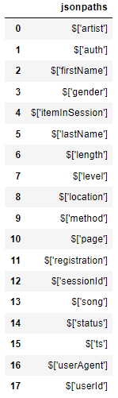

# Introduction
A music streaming startup, Sparkify, has grown its user base and song database and wants to move the processes and data onto the cloud. The data resides in S3, in a directory of JSON logs on user activity on the app and a directory with JSON metadata on the songs in their app.

The code in this repository builds an ETL pipeline that extracts data from S3, stages them in Redshift, and transforms data into a set of dimensional tables for the analytics team to continue finding insights into what songs users are listening to.

# Datasets
The original three datasets reside in S3. Here are the S3 links for each:
* Song data: `s3://udacity-dend/song_data`
* Log data: `s3://udacity-dend/log_data`
* Meta information of log data: `s3://udacity-dend/log_json_path.json`

## Song Dataset
Each file is in JSON format and contains metadata about a song and the artist of that song. The files are partitioned by the first three letters of each song's track ID. For example, here are file paths to two files in this dataset.
```
song_data/A/B/C/TRABCEI128F424C983.json
song_data/A/A/B/TRAABJL12903CDCF1A.json
```
And below is an example of what a single song file, `TRAABJL12903CDCF1A.json`, looks like.
```
{"num_songs": 1, "artist_id": "ARJIE2Y1187B994AB7", "artist_latitude": null, "artist_longitude": null, "artist_location": "", "artist_name": "Line Renaud", "song_id": "SOUPIRU12A6D4FA1E1", "title": "Der Kleine Dompfaff", "duration": 152.92036, "year": 0}
```

## Log Dataset
The second dataset consists of log files in JSON format based on the songs in the dataset above. These logs are from an imaginary music streaming app based on configuration settings. The log files are partitioned by year and month. For example, here are file paths to two files in this dataset.
```
log_data/2018/11/2018-11-12-events.json
log_data/2018/11/2018-11-13-events.json
```
And below is an example of what the data in a log file, 2018-11-12-events.json, looks like.
~[log_data image](images/log-data.png)

## Log JSON Meta Information
And below is what data is in `log_json_path.json`.


# Schema for Song Play Analysis
Using the song and event datasets, this project creates a star schema optimized for queries on song play analysis. This includes the following tables.

## Fact Table
1. **songplays**: records in event data associated with song plays i.e. records with page `NextSong`.
* *songplay_id, start_time, user_id, level, song_id, artist_id, session_id, location, user_agent*

## Dimension Tables
1. **users**: users in the app
* *user_id, first_name, last_name, gender, level*
1. **songs**: songs in the music database
* *song_id, title, artist_id, year, duration*
1. **artists**: artists in the music database
* *artist_id, name, location, latitude, longitude*
1. **time**: timestamps of records in songplays broken down into specific units
* *start_time, hour, day, week, month, year, weekday*

# Project Files
The project includes four files:
* `create_table.py`: create the fact and dimension tables for the star schema in Redshift.
* `etl.py`: load data from S3 into staging tables on Redshift and then process that data into the analytics tables on Redshift.
* `sql_queries.py`: define the SQL statements, which will be imported into the two other files above.
* `README.md`: provide discussion on the process and decisions for this ETL pipeline.

# Prerequisites
You should prepare an IAM user with the `AdministratorAccess` policy. The access key and secret of this IAM user are required to fill the following sections in `dwh.cfg`.
```
[AWS]
KEY=
SECRET=
REGION=

[CLUSTER]
HOST=
DB_NAME=
DB_USER=
DB_PASSWORD=
DB_PORT=

[IAM_ROLE]
ARN=
```

Also, the Amazon Redshift should be ready using the [class notebook](https://learn.udacity.com/nanodegrees/nd027/parts/cd12440/lessons/66fb2f6c-0071-4ce7-ad9e-037fbb32c56a/concepts/17661e18-493b-44fa-88b4-5b76e36924f3). You'll get the endpoint for the `HOST` in `CLUSTER` section, and `ARN` in `IAM_ROLE` section. **Please, be carefull not to execute the step 5.**

# Examples of Potential Queries
What is the most played song?
```SQL
WITH temp AS (SELECT songs.title, COUNT(*) AS cnt
FROM songplays
JOIN songs ON (songplays.song_id = songs.song_id)
GROUP BY songs.title)
SELECT * FROM temp ORDER BY cnt DESC LIMIT 10;
```
When is the highest usage time of day by hour for songs?
```SQL
WITH temp AS (SELECT time.hour, COUNT(*) AS cnt
FROM songplays
JOIN time ON (songplays.start_time = time.start_time)
GROUP BY time.hour)
SELECT * FROM temp ORDER BY cnt DESC LIMIT 10;
```
