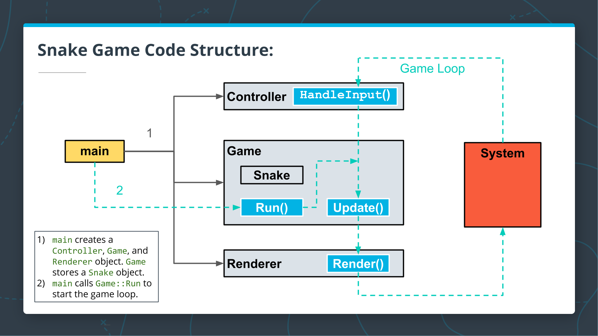

# CPPND: Capstone Snake Game Example

Embark on an exciting journey through this captivating 2D Snake game, fueled by inspiration drawn from an outstanding [StackOverflow post](https://codereview.stackexchange.com/questions/212296/snake-game-in-c-with-sdl) and its enlightening array of responses. Crafted with passion, the code has been meticulously tailored to exceed the project prerequisites of the esteemed [Udacity C++ Nanodegree Program](https://www.udacity.com/course/c-plus-plus-nanodegree--nd213). Get ready to immerse yourself in a world of slithering serpents and endless fun! 🐍🎮

## Dependencies for Running Locally
* cmake >= 3.7
  * All OSes: [click here for installation instructions](https://cmake.org/install/)
* make >= 4.1 (Linux, Mac), 3.81 (Windows)
  * Linux: make is installed by default on most Linux distros
  * Mac: [install Xcode command line tools to get make](https://developer.apple.com/xcode/features/)
  * Windows: [Click here for installation instructions](http://gnuwin32.sourceforge.net/packages/make.htm)
* SDL2 >= 2.0
  * All installation instructions can be found [here](https://wiki.libsdl.org/Installation)
  >Note that for Linux, an `apt` or `apt-get` installation is preferred to building from source. 
* gcc/g++ >= 5.4
  * Linux: gcc / g++ is installed by default on most Linux distros
  * Mac: same deal as make - [install Xcode command line tools](https://developer.apple.com/xcode/features/)
  * Windows: recommend using [MinGW](http://www.mingw.org/)

## Basic Build Instructions

1. Clone this repo.
2. Make a build directory in the top level directory: `mkdir build && cd build`
3. Compile: `cmake .. && make`
4. Run it: `./SnakeGame`.

## Code Structure

The Snake game code consists of four main classes: `Game`, `Snake`, `Controller`, and `Renderer`. The image above shows how the code functions:

1. To begin, `main` creates a `Controller`, a `Game`, and a `Renderer` object. `Game` stores a `Snake` object as part of the state.
1. `main` calls `Game::Run` to start the game loop.

## Rubric Points Addressed

### Loops, Functions, I/O

| Rubric Point | Location |
| --- | --- |
| The project demonstrates an understanding of C++ functions and control structures. | [game.cpp](src/game.cpp) |
| The project reads data from a file and process the data, or the program writes data to a file. | [main.cpp](src/main.cpp) |
| The project accepts user input and processes the input. | [controller.cpp](src/controller.cpp) |

### Object Oriented Programming

| Rubric Point | Location |
| --- | --- |
| The project uses Object Oriented Programming techniques. | [game.h](src/game.h) |
| Classes use appropriate access specifiers for class members. | [game.h](src/game.h) |
| Class constructors utilize member initialization lists. | [game.cpp](src/game.cpp) |
| Classes abstract implementation details from their interfaces. | [game.h](src/game.h) |
| Classes encapsulate behavior. | [game.h](src/game.h) |
| Classes follow an appropriate inheritance hierarchy. | [snake.h](src/snake.h) |
* | Overloaded functions allow the same function to operate on different parameters. | [game.h](src/game.h) |
| Derived class functions override virtual base class functions. | [snake.h](src/snake.h) |
* | Templates generalize functions in the project. | [game.h](src/game.h) |

### Memory Management

| Rubric Point | Location |
| --- | --- |
| The project makes use of references in function declarations. | [game.h](src/game.h) |
| The project uses destructors appropriately. | [renderer.cpp](src/renderer.cpp) |
| The project uses scope / Resource Acquisition Is Initialization (RAII) where appropriate. | [renderer.cpp](src/renderer.cpp) |
* | The project follows the Rule of 5. | [game.h](src/game.h) |
* | The project uses move semantics to move data, instead of copying it, where possible. | [game.h](src/game.h) |
* | The project uses smart pointers instead of raw pointers. | [game.h](src/game.h) |

### Concurrency

| Rubric Point | Location |
| --- | --- |
* | The project uses multithreading. | [game.h](src/game.h) |
* | A promise and future is used in the project. | [game.h](src/game.h) |
* | A mutex or lock is used in the project. | [game.h](src/game.h) |
* | A condition variable is used in the project. | [game.h](src/game.h) |

## CC Attribution-ShareAlike 4.0 International

Shield: [![CC BY-SA 4.0][cc-by-sa-shield]][cc-by-sa]

This work is licensed under a
[Creative Commons Attribution-ShareAlike 4.0 International License][cc-by-sa].

[![CC BY-SA 4.0][cc-by-sa-image]][cc-by-sa]

[cc-by-sa]: http://creativecommons.org/licenses/by-sa/4.0/
[cc-by-sa-image]: https://licensebuttons.net/l/by-sa/4.0/88x31.png
[cc-by-sa-shield]: https://img.shields.io/badge/License-CC%20BY--SA%204.0-lightgrey.svg
